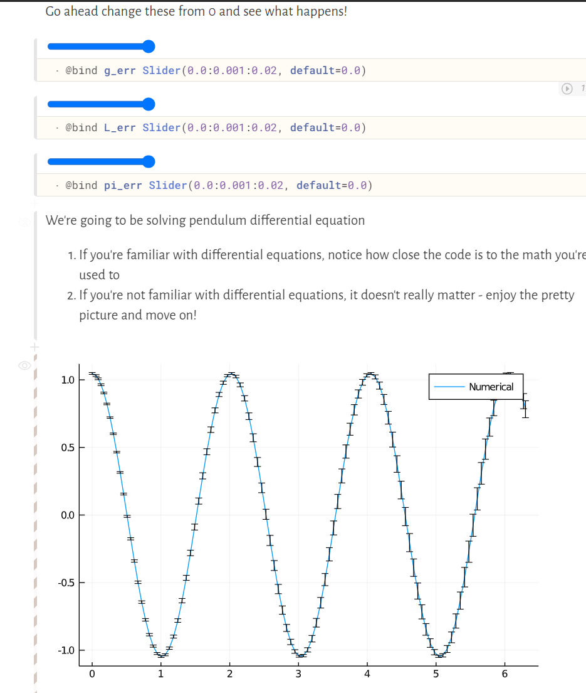

# How Multiple Dispatch lets you write Composable software

This is an interactive tutorial made in a Pluto.jl notebook

We'll be going over how Multiple Dispatch lets you write
1. Game/Physics Engines
2. Type Specialized Matrix Multiplication
3. Dealing with Uncertainty in packages that don't support uncertainty
4. Automatic Differentiation a Tweet long implementation

## Usage

### Run remotely (easiest way)
Click here https://mybinder.org/v2/gh/fonsp/vscode-binder/master?urlpath=pluto/open?url=https%3A%2F%2Fraw.githubusercontent.com%2Fmsaroufim%2Fmultiple_dispatch%2Fmaster%2Fsrc%2Fmultiple_dispatch.jl

### Run remotely
1. Go to https://pluto-on-binder.glitch.me/
2. Put in my notebook url https://github.com/msaroufim/multiple_dispatch/blob/master/src/multiple_dispatch.jl
3. Push enter and give it a a minute or two, loading the Julia libraries takes a while

### Run locally

1. using Pluto
2. Pluto.run(1234)
3. Navigate to ```localhost:1234``` in your browser and open up the file


One of the many pretty pictures in this article showing how you can get error bars for free in a differential equation solver that doesn't natively support uncertainty using multiple dispatch.

